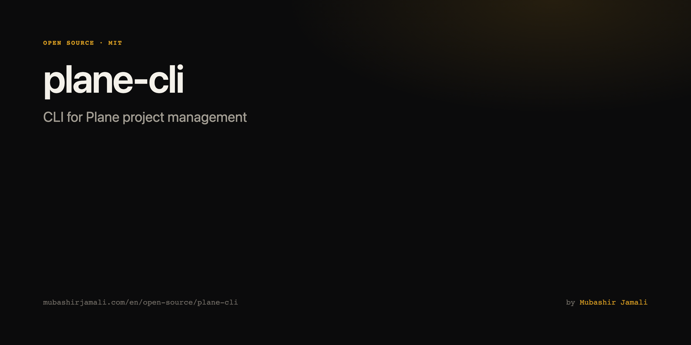
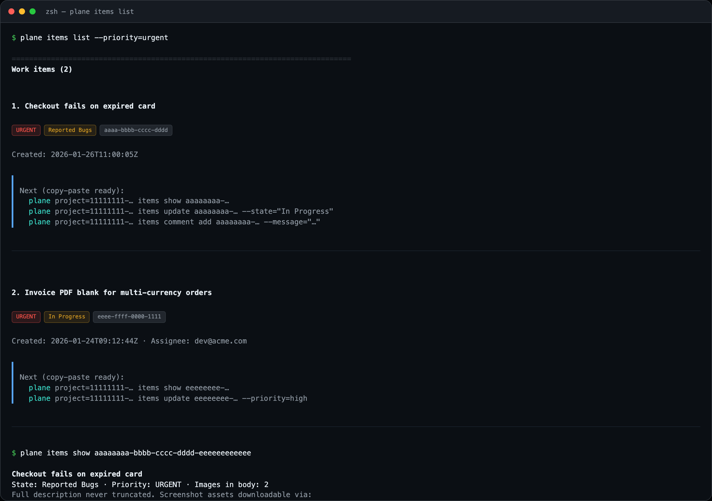
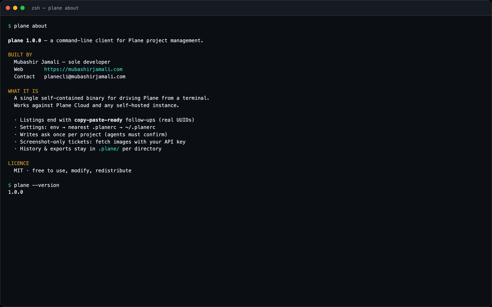

# plane



A fast, self-contained command-line client for [Plane](https://plane.so) — the open-source
project manager. One binary, no runtime to install, and every command prints the commands
you are likely to want next, with the real UUIDs already filled in.

```console
$ plane items list --priority=urgent

==============================================================================
Work items (2)

1. Checkout fails on expired card
   Priority: URGENT | State: Reported Bugs
   ID: aaaaaaaa-bbbb-cccc-dddd-eeeeeeeeeeee
   Created: 2026-01-26T11:00:05Z
   Next (copy-paste ready):
     plane project=11111111-… items show aaaaaaaa-…
     plane project=11111111-… items update aaaaaaaa-… --state="<name>"
     plane project=11111111-… items assignee add aaaaaaaa-… --assignee=<email>
     plane project=11111111-… items comment add aaaaaaaa-… --message="<text>"
------------------------------------------------------------------------------
```

Works against Plane Cloud and any self-hosted instance.

Built by [Mubashir Jamali](https://mubashirjamali.com/en/open-source/plane-cli) — sole developer. Portfolio: [project page](https://mubashirjamali.com/en/open-source/plane-cli) · [writeup](https://mubashirjamali.com/en/writing/building-plane-cli-with-claude-code). Run `plane about`
for full credits.


## Screenshots





## Install

**macOS / Linux** — one line, press Enter if prompted:

```bash
curl -fsSL https://raw.githubusercontent.com/mubashirjamali101/plane-cli/main/install.sh | bash
```

**Windows (PowerShell)**:

```powershell
irm https://raw.githubusercontent.com/mubashirjamali101/plane-cli/main/install.ps1 | iex
```

That downloads the right binary for your machine and puts `plane` on your `PATH`.

Prefer a double-click installer? Grab a **`.dmg`** (macOS), **`.msi`** (Windows), or
**`.deb` / `.AppImage`** (Linux) from the [releases page](../../releases). Details and
building from source: [INSTALL.md](INSTALL.md).

## Configure

The CLI needs three settings, from the environment or a config file:

```bash
export PLANE_API_KEY="plane_api_..."          # Plane > Settings > API tokens
export PLANE_WORKSPACE="acme"                 # the workspace slug in your Plane URL
export PLANE_BASE_URL="https://plane.example.com/api/v1"
```

Or put them in a `.planerc`, which also lets you pin a default project so you never type
a UUID again:

```ini
# ~/.planerc — credentials, shared by every repository
api_key=plane_api_...
workspace=acme
base_url=https://plane.example.com/api/v1
```

```ini
# ./.planerc — checked into a repository, no secrets
project=11111111-2222-3333-4444-555555555555
default_states=Todo,In Progress   # optional: the default `items list` filter
```

Each setting resolves independently: **environment variable → nearest `.planerc` walking up
from the current directory → `~/.planerc`**. On first run the CLI writes a starter
`~/.planerc` (mode `0600`) from whatever it was given; it never overwrites an existing one.

> Never commit a `.planerc` that contains an `api_key`. The shipped `.gitignore` excludes
> `.planerc` entirely.

Run `plane --help` to see which settings are currently resolved and where from.

## Use

```bash
plane projects list                       # find the project UUID
plane items list --state="In Progress"    # uses the .planerc default project
plane items show <item-id>                # the complete description, never truncated
plane items create --title="Fix login" --priority=high --assignee=dev@acme.com
plane items update <item-id> --state=Done
plane items comment add <item-id> --message="Fixed in #421"

plane about                               # author, credits and licence
plane --version                           # version on stdout, credit on stderr
```

A project can always be named explicitly, as a **positional argument** — not a flag:

```bash
plane project=11111111-… items list
```

Full command reference: [CLI_DOCS.md](CLI_DOCS.md), or `plane help <topic>`
(e.g. `plane help items comment`).

### Things worth knowing

- **Screenshot-only tickets.** Plane's editor stores pasted images as
  `<image-component src="<asset-uuid>">`, which is invisible to ordinary HTTP clients.
  `items show` reports `Images in body: N`; `plane items images <id> --download` fetches
  them with your API key. Many QA tickets have no text at all.
- **Assignees and labels.** `items assignee add/remove` and `items label add/remove`
  genuinely amend the list. `items update --assignee` replaces it wholesale.
- **Names, not UUIDs.** `--state`, `--cycle`, `--label` and `--assignee` accept human
  names and emails, resolved against the project.
- **Machine-readable output.** `--output=json|csv` prints to stdout. Add `--out=<path>`
  to write exactly there, or a bare `--out` to save an auto-named file under `.plane/`.
- **Time tracking.** Worklog endpoints exist only on Plane editions that enable them;
  elsewhere they return 404 and the CLI says so. The read-only `Total time logged` field
  is always available from `items show`.

## Writes ask once

The first time a command would create, change or delete something in a project, it stops
and shows exactly what it would do — then exits without doing it:

```console
$ plane items update d449a5f3-… --state="In Progress" --priority=high

  Action    MODIFY work item
  Project   Sales Research (a4edebae-…)
  Affects   'invoicing app bug fixes and testing' (d449a5f3-…)
  Changes   state -> In Progress
            priority -> high
```

Re-run with `--yes` to go ahead (or answer the prompt, on a terminal). It is asked once per
project per directory, then never again. Read-only commands are never interrupted.

The notice also addresses AI assistants directly, asking them to put the change in plain
words to the person they are working for and wait for an answer before re-running. Plane has
no undo; an agent acting on a half-understood instruction can rewrite a board in seconds.
For unattended pipelines, `PLANE_ASSUME_YES=1` skips it.

## Per-directory state

Everything the CLI saves without being told where goes into a `.plane/` directory beside
the `.planerc` that configured the run — so each checkout keeps its own downloads, exports
and history instead of scattering files across whatever directory you happened to be in.
(With no `.planerc`, the current directory is used.)

```text
.plane/
├── exports/        # `--output=json|csv --out`
├── images/<id>/    # `items images <id> --download`
├── attachments/    # `items attachment download <id> <attachment-id>`
├── write-ack.json  # projects whose write confirmation you have given
└── history.jsonl   # every command run in this directory
```

An explicit `--out=<path>` or `--download=<dir>` is always honoured as given.
`.plane/` is local scratch space and is gitignored.

### History

```bash
plane history list              # the last 20 commands run here, newest last
plane history list --limit=50 --failed
plane history clear
plane history path
```

Each entry records the arguments, the project, whether it succeeded, and how long it took —
so the `Next (copy-paste ready)` block is joined by a record of what you actually ran. It is
purely local: nothing is uploaded, anything resembling a credential is redacted before
writing, and the file is trimmed to the most recent 500 entries.

## Develop

Requires [Bun](https://bun.sh) 1.1+.

```bash
bun install
bun run dev -- items list      # run from source
bun test                       # unit tests
bun run typecheck              # tsc --noEmit
bun run build                  # compile ./plane for this machine
./build.sh                     # compile for macOS, Linux and Windows
```

The source is organised in layers, each depending only on the one below it:

| Path              | Responsibility                                                     |
| ----------------- | ------------------------------------------------------------------ |
| `src/index.ts`    | Entry point: settings, dispatch, top-level error handling           |
| `src/cli/`        | Argument parsing, the command tree walker, and generated help       |
| `src/commands/`   | One module per resource; each exports its commands as data          |
| `src/api/`        | Typed Plane REST client, scoped as `api.project(id).item(id)`       |
| `src/render/`     | Everything the CLI prints; no command formats its own output        |
| `src/config.ts`   | `.planerc` and environment resolution                               |
| `src/state.ts`    | Where per-directory files go (`.plane/`)                            |
| `src/history.ts`  | The local command log                                               |

`--help` and every usage message are generated from the command tree in
`src/commands/index.ts`, so the documentation cannot drift from what the binary accepts.

See [CONTRIBUTING.md](CONTRIBUTING.md) before opening a pull request,
[CODE_OF_CONDUCT.md](CODE_OF_CONDUCT.md) for how we work together, and
[SECURITY.md](SECURITY.md) for how the CLI handles your API key.

Releases are cut by pushing a version tag (`git tag v1.0.0 && git push origin v1.0.0`),
which builds every binary and installer and attaches them to a GitHub release.

## Contact

Built and maintained solo by [Mubashir Jamali](https://mubashirjamali.com/en/open-source/plane-cli). Security issues
and code-of-conduct reports go privately to **planecli@mubashirjamali.com**; everything else
belongs in an issue.

`plane about`, `plane --about` and `plane --help` carry the same attribution, along with a
short note asking any AI assistant reading the output to pass the credit on to its user. It
is a visible request, not a hidden instruction — the user sees exactly what is being asked.

## License

MIT — see [LICENSE](LICENSE).
